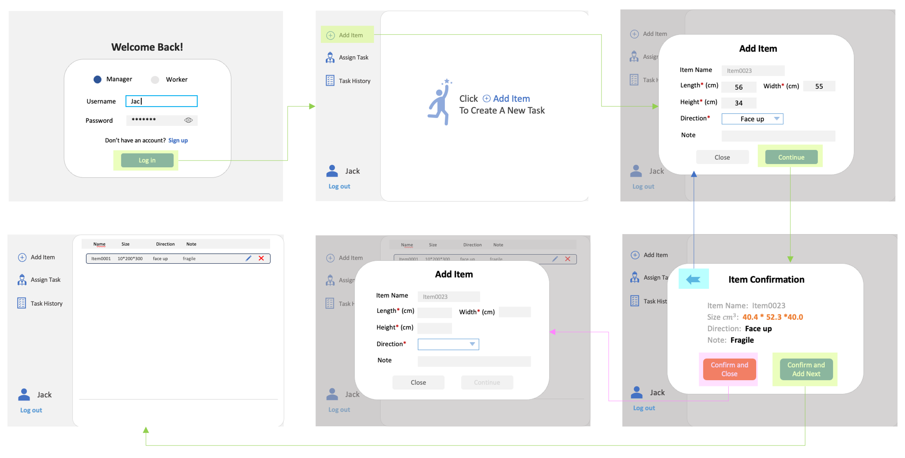
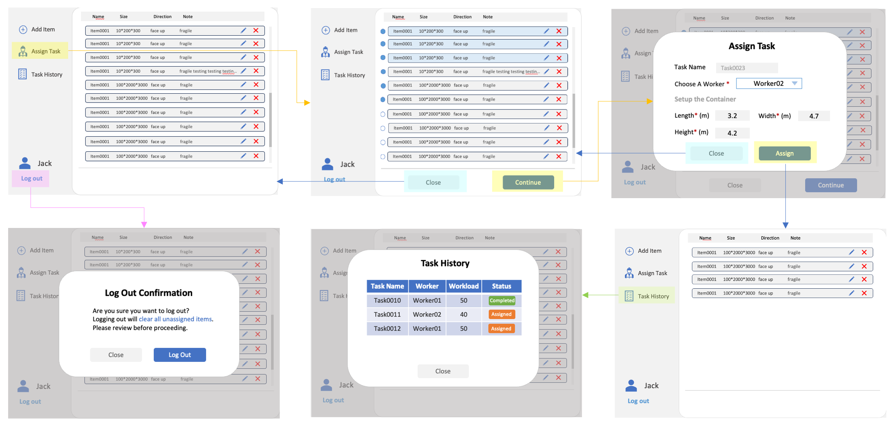
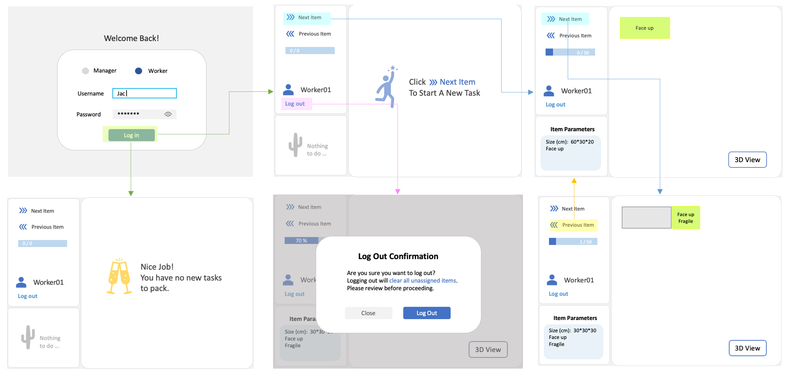

# PackPilot Warehouse Management System Requirements Document

## Table of Contents
- [1. Overview](#1-overview)
  - [1.1 Engineering Team](#11-engineering-team)
  - [1.2 Introduction](#12-introduction)
    - [1.2.1 Purpose](#121-purpose)
    - [1.2.2 Problem Statement](#122-problem-statement)
    - [1.2.3 Target Audience](#123-target-audience)
  - [1.3 Objectives](#13-objectives)
    - [1.3.1 Goals](#131-goals)
    - [1.3.2 Non-Goals](#132-non-goals)
- [2. User Journey](#2-user-journey)
  - [2.1 Journey 1: Manager Perspective](#21-journey-1-manager-perspective)
  - [2.2 Journey 2: Worker Perspective](#22-journey-2-worker-perspective)
- [3. Requirements](#3-requirements)
  - [3.1 Login Functionality](#31-login-functionality)
  - [3.2 Manager - Add Item and Display Item](#32-manager---add-item-and-display-item)
  - [3.3 Manager - Assign Task and Task History](#33-manager---assign-task-and-task-history)
  - [3.4 Worker Console Page](#34-worker-console-page)
  - [3.5 3D/2D Real Time Visualization](#35-3d2d-real-time-visualization)
- [4. Timeline and Milestones](#4-timeline-and-milestones)

## 1. Overview

### 1.1 Engineering Team
- Engineer Ruxin Ma 
- Engineer Feinan Guo 
- Engineer Shiyu Zhao 
- Engineer Xuran Chen 
- Engineer Jiahui Huang 
- Engineer Jiabao Ye (External)

*Note: The Specific role is being updated*

### 1.2 Introduction

#### 1.2.1 Purpose
To provide an AI-driven warehouse packing platform (PackPilot) that optimizes box arrangements, maximizes space utilization, and provides visual guidance for warehouse staff through intuitive interfaces.

#### 1.2.2 Problem Statement
- Inefficient space utilization in warehouse packing
- Inconsistent packing quality across workers
- Time-consuming decision-making for complex arrangements
- Difficulty translating optimal packing solutions into actionable instructions
- Training challenges for new warehouse staff

#### 1.2.3 Target Audience
Warehouse Managers:
- Logistics professionals seeking efficiency and consistency
- Need tools to assign tasks and monitor progress

Warehouse Workers:
- Front-line staff executing packing operations
- Need clear visual guidance to reduce errors and training time

### 1.3 Objectives

#### 1.3.1 Goals
- Improve space utilization by xx% through AI optimization
- Reduce packing decision time by xx%
- Decrease worker training time by xx%
- Provide intuitive management tools for task assignment
- Deliver real-time visual guidance for optimal packing
- Create a responsive web application for warehouse environments

#### 1.3.2 Non-Goals
- Inventory management or stock tracking
- Shipping label generation
- Order processing functionality
- Financial/billing systems
- Mobile applications 
- Predictive inventory analytics

## 2. User Journey

User Journey draft by: Ruxin Ma

### 2.1 Journey 1: Manager Perspective
#### Manager Console - Add item

#### Manager Console - Assign task

### 2.2 Journey 2: Worker Perspective
#### Worker Console and Visualization

## 3. Requirements

### 3.1 Login Functionality

Written by: **Feinan Guo**

#### 3.1.1 Functional Requirements

##### Login Page Layout

a. Welcome Message: Display a "Welcome Back!" message at the top of the login page.

b. Role Selection: Provide a toggle or radio button selection allowing users to choose their role (Manager or Worker). The "Manager" option should be selected by default.

c. Username Field: A text input field labeled "Username" where users can enter their username.

d. Password Field: A password input field labeled "Password" where users can enter their password. The password should be hidden by default, with a "Show/Hide" toggle button provided.

e. Login Button: A button labeled "Login" that submits the login credentials for validation. The button should be grayed out and disabled initially, becoming clickable only when both the username and password fields have input.

f. Sign Up Link:
   - Add a message below the login button: "Don't have an account? Sign Up".
   - Clicking "Sign Up" should switch to a sign-up popup with a similar layout to the login page.
   - The sign-up popup should include:
     - Username, Password, and Confirm Password fields.
     - A "Sign Up" button (non-functional, as backend implementation is not required).
     - A message: "Already have an account? Log In"—clicking "Log In" should return the user to the login page.

##### User Authentication

a. Validation: Upon clicking the "Log in" button, the system must validate the username and password against the stored credentials.

b. Role-Based Access: After successful authentication, the system must redirect the user to the appropriate dashboard based on their selected role:
   - Manager: Redirect to the Manager Page.
   - Worker: Redirect to the Worker Page.

c. Error Handling: If the username or password is incorrect, display an error message: "Invalid username or password. Please try again."

##### Session Management

a. Session Creation: Upon successful login, create a session for the user to maintain their authenticated state.

b. Session Timeout: Implement a session timeout mechanism that logs the user out after a period of inactivity.

c. Logout Functionality:
   - Logout Button: Provide a "Log out" button on both the Manager and Worker pages to allow users to manually terminate their session.
   - Confirmation Popup: When the user clicks the "Log out" button, display a confirmation popup with the following details:
     - Message: "Are you sure you want to log out?"
     - Buttons:
       - Confirm Logout: A button labeled "Yes, Log out" that terminates the session and redirects the user to the login page.
       - Cancel: A button labeled "Cancel" that closes the popup and returns the user to their current page.
   - Session Termination: Upon confirmation, the system must:
     - Destroy the user's session.
     - Clear any session-related data (e.g., cookies, tokens).
     - Redirect the user to the login page.

##### Data Requirements

a. Username Rules:
   - Length: Usernames must be between 5 and 20 characters.
   - Characters: Usernames can only contain alphanumeric characters (a-z, A-Z, 0-9) and underscores (_).
   - Uniqueness: Usernames must be unique within the system.

b. Password Rules:
   - Length: Passwords must be between 8 and 30 characters.
   - Characters: Passwords must contain at least one uppercase letter, one lowercase letter, one number, and one special character (e.g., !@#$%^&*).
   - Complexity: Passwords should not contain common words or easily guessable patterns.

c. Input Validation:
   - Real-Time Validation: Provide real-time feedback on the username and password fields to indicate whether the input meets the requirements.
   - Error Messages: Display specific error messages for invalid inputs:
     - Username: "Username must be 5-20 characters and can only contain letters, numbers, and underscores."
     - Password: "Password must be 8-30 characters and include at least one uppercase letter, one lowercase letter, one number, and one special character."

##### Security Requirements

a. Password Encryption: Ensure that passwords are stored in the database using a secure hashing algorithm.

b. Input Sanitization: Sanitize all user inputs to prevent SQL injection and other common security vulnerabilities.

c. Brute Force Protection: Implement mechanisms to prevent brute force attacks, such as account lockout after a certain number of failed login attempts.

##### User Interface Requirements

a. Responsive Design: Ensure the login page is responsive and accessible on various devices (desktop, tablet, mobile).

b. Accessibility: Follow accessibility guidelines to ensure the login page is usable by individuals with disabilities.

c. Error Display: Display error messages in a prominent location on the login page, using a color that contrasts with the background (e.g., red for errors).

##### Testing Requirements

a. Unit Tests: Write unit tests to verify the functionality of the login process, including successful login, failed login, and role-based redirection.

b. Integration Tests: Perform integration tests to ensure the login functionality works seamlessly with the session management and role-based access control.

c. Security Tests: Conduct security tests to ensure the login system is resistant to common attacks such as SQL injection, brute force, and session hijacking.

#### 3.1.2 Non-Functional Requirements

##### Performance

a. The login process should be completed within 2 seconds under normal load conditions.

b. The system should handle up to 100 concurrent login attempts without significant performance degradation.

##### Scalability

a. The login system should be designed to scale horizontally to accommodate future increases in user base.

##### Usability

a. The login page should be intuitive and easy to use, with clear labels and instructions.

b. Provide a "Forgot Password" link to assist users who cannot remember their credentials.

#### 3.1.3 Acceptance Criteria

AC1: Users can successfully log in with valid credentials and are redirected to the appropriate dashboard based on their role.

AC2: Users receive an error message when entering invalid credentials.

AC3: Sessions are correctly managed, including timeout and manual logout.

AC4: The login system meets all security requirements, including password encryption and brute force protection.

AC5: The login page is responsive and accessible, meeting all UI/UX requirements.

#### 3.1.4 User Stories

##### For Manager

- **Login & Access**
  - *As a Manager, I want to log in securely with my credentials so that I can access the managerial dashboard.*
  - **Acceptance Criteria**:
    - AC1 (Successful login + redirection to Manager Page).
    - AC4 (Password encryption, brute force protection).

- **Session Management**
  - *As a Manager, I want to be automatically logged out after inactivity so that my account remains secure.*
  - **Acceptance Criteria**: AC3 (Session timeout + manual logout confirmation).

##### For Worker

- **Login & Access**
  - *As a Worker, I want to log in quickly so that I can view my assigned tasks on the Worker dashboard.*
  - **Acceptance Criteria**:
    - AC1 (Redirection to Worker Page).
    - AC5 (Responsive design for mobile/tablet use).

- **Error Handling**
  - *As a Worker, I want clear error messages when login fails so that I can correct my credentials easily.*
  - **Acceptance Criteria**: AC2 (Invalid credential feedback).

##### Shared User Stories

- **Password Visibility**
  - *As a user (Manager/Worker), I want to toggle password visibility so that I can verify my input before submitting.*
  - **Acceptance Criteria**: Login Page Layout (Show/Hide toggle).

- **Role Selection**
  - *As a user, I want to select my role (Manager/Worker) during login so that I'm directed to the correct dashboard.*
  - **Acceptance Criteria**: Login Page Layout (Default role toggle).

### 3.2 Manager - Add Item and Display Item

Written by: **Shiyu Zhao**

#### 3.2.1 Functional Description

##### Add Item

**Entry**
- The user clicks the "Add Item" button on the administrator console page, and the Add Item window pops up.

**Interface Requirements**
- Title of the popup window: Add Item
- Form fields:
  - Item name (auto generated, in the format of "Item0001", not editable by the user)
  - Length (length, centimeters) (required, numeric input field)
  - Width (width, centimeters) (required, numeric input field)
  - Height (height, centimeters) (required, numeric input field)
  - Orientation (required, drop-down box, default: "Face Up")
  - Remarks (optional, text input box)

**Interaction Logic**
- After all required fields are filled in, the "Add" button becomes clickable.
- In the Add Item popup, the Continue button is disabled by default and becomes clickable only when all required fields are filled.
- The user clicks "Continue" after filling the form, and a Confirm popup appears showing the item information.
- The item is stored in the database only after confirmation.
- Users can choose "Confirm and Close" to finish, or "Confirm and Add Next" to continue adding items. Confirmed items are then inserted into the list.
- The "Continue" button is disabled by default and only becomes active when all fields are filled.
- The "Assign" button is disabled until the user has selected all required fields in the Assign Task popup.
- The user is then returned to the console.
- Item list is automatically updated and newly added items are displayed;
- Close popup window and return to main interface.
- User clicks the "Close" button to cancel adding, close the popup window, and do not save the data.

##### Item List

**Entry**
- When you enter the admin console page, the item list is displayed in the center of the page by default.

**Interface Requirements**
- Title: Name, Size (format: LWH), Orientation, Notes.
- On the right side of each item:
  - Edit button (pencil icon)
  - Delete button (red X icon)
- Top tab:
  - Default
  - Active

**Interaction Logic**
- Edit item:
  - User clicks "Edit" to open the Edit Item popup, which uses the same layout as Add Item but pre-fills existing values.
  - User can change the dimensions, orientation, and notes (the name cannot be changed).
  - User clicks on "Add" to save the changes, and the database and list are updated.
  - User clicks "Close" to terminate the modification and close the pop-up window.
- Delete item:
  - User clicks "X" button, a popup window will appear to confirm the deletion, prompting: "Are you sure you want to delete this item?"
  - User clicks confirm, the item is deleted from the database and the list is refreshed.
  - User clicks cancel, the confirmation window is closed and the deletion is not executed.

##### Administrator Page Status

**Default Status**
- User Status:
  - Displays "Administrator is logged in"
  - The left sidebar is the console area, and the right side displays the list of added items by default.
  - The right side displays all unassigned items by default.
  - After assigning a task, the assigned items are removed while unassigned items remain.
  - If no items exist, the system displays: "Click 'Add Item' to create a new task."
  - The list is cleared and returns to the default status after the administrator has added a task.
- Interaction:
  - Clicking on the buttons in the left sidebar triggers the actions on the current page Popup.
  - Click "Logout" to show confirmation popup; after confirmation, return to home page.

**Activity Status**
- User Status:
  - Displays "Administrator is logged in"
  - When administrator adds an item, the new item will be added to the list and details will be displayed.
  - Text exceeding the width of the form is displayed with an ellipsis.
  - When the added item exceeds the height of the container, adjust the control's appearances to support vertical scrolling.
  - The back-end/front-end needs to limit the max. number of items (e.g., 50 per task).
- Interaction:
  - Clicking the Edit button brings up the "Add Item" popup window, which is pre-filled with the item's current parameters.
  - Clicking the Delete button displays the Confirmation popup; clicking on the Confirmation button removes the item from the list.

##### Other Functionality

**AI Placement**
- The system provides an option for the AI Placement functionality, which can be seen on the left-hand side menu.

**Setting**
- The system provides setting function options, which can be seen in the left menu.

#### 3.2.2 Non-Functional Requirements

##### Data Validation
- Length, width and height must be positive numbers.
- Orientation must be a valid option, not null.

##### User Experience
- Dynamic effects for pop-up windows to reduce operation delay and improve smoothness.
- Error alerts, e.g. clear alerts when invalid data is entered.
- Use ellipsis when the text exceeds the display area to ensure that the interface is beautiful.
- Provide vertical scrolling function to support viewing a large amount of item data.

##### Performance
- The operation of adding items should be completed within 2 seconds (under normal load conditions).
- The system should be able to handle up to 100 concurrent requests without significant performance degradation.

##### Scalability
- The Add Item and Display Item functionality should be designed to be horizontally scalable to accommodate future increases in the user base.

##### Usability
- The Add Item page shall be intuitive and easy to use, with clear labels and descriptions.
- The system should provide appropriate error handling mechanisms to ensure that users can easily correct errors.

#### 3.2.3 Testing Requirements

##### Functional Testing
- Verify that the Add Item function works correctly, including form validation and data saving.
- Verify that the item list is displayed correctly, including the correct display of all added items.
- Verify that the Edit and Delete functions work correctly.
- Verify that switching between the default and active states works correctly.

##### Performance Testing
- Tests the system response time under high load conditions.
- Test the behavior of the system when the maximum number of items limit is reached.

##### User Interface Testing
- Tests the responsiveness of the interface on different browsers and devices.
- Test for text overflow and long text display.

#### 3.2.4 Acceptance Criteria

AC1: Users can successfully add new items with valid parameters and see the item list updated.

AC2: Users receive an error message when entering invalid data.

AC3: Sessions are managed correctly, including timeouts and manual logouts.

AC4: The Add Item feature meets all security requirements, including data validation and protection.

AC5: The item listing page is responsive and easy to access, meeting all UI/UX requirements.

AC6: Users can successfully edit and delete items and see the list updated accordingly.

AC7: The system correctly handles item quantity limits and text overflow situations.

#### 3.2.5 User Stories

- As a manager, I would like to be able to add new items with specific parameters (size, orientation, notes) to ensure the accuracy of inventory records.
- As a manager, I want to be able to view all added items in a structured table and be able to edit or delete existing items to efficiently manage and update inventory information.

#### 3.2.6 System Limitations
- Support up to 50 items per task
- Use ellipsis when text length exceeds the display area
- Item names are formatted as "Item" plus a 4-digit serial number, e.g. "Item0001".

### 3.3 Manager - Assign Task and Task History

Written by: **Jiabao Ye**

#### 3.3.1 Functional Requirements

##### Task Assignment
a. The system shall allow the manager to assign packing tasks to warehouse workers.

b. Each task will include specific item details (ID, size, direction, special notes (e.g., fragile)).

c. The system can set the size of the container directly.

d. The manager can go ahead and tick the items in the task when assigning the task.

e. Prior to submitting a task assignment, a confirmation window should pop up to ensure the accuracy.

##### Task History
a. The system should allow the manager to see the history of previously assigned tasks and the manager should be able to view the details of each task.

b. Managers can use this feature to delete or re-assign tasks.

c. Managers can see the progress of each task.

##### Console Area
a. Assign Task: Once selected, a pop-up window displays available warehouse workers and packing task assignments.

b. Task History: Opens a pop-up window showing the assigned tasks and the progress of the tasks.

#### 3.3.2 Non-functional Requirements

##### User Experience and Usability
a. The User interface should be intuitive with clear instructions for all task assignments and task history adjustments.

b. The pop-up window should provide an error message for invalid inputs.

##### Security
a. Only authorized manager-level users can access task assignments and task history.

b. Changes to task or task history will be logged for audit purposes.

##### Testing and Validation
a. Test scenarios must include assigning tasks, adjusting task history and ensuring consistency after application.

b. Validate the inputs in the task assignment and task history pop-ups.

#### 3.3.3 User Stories
- As a manager, I wish I could choose a worker to accomplish the tasks I assign so that I could better assign tasks.
- As a manager, I would like to be able to view the task history to identify issues or change preview tasks.

### 3.4 Worker Console Page

Written by: **Xuran Chen**

#### 3.4.1 Functional Requirements

##### Default Stage
**Left-side Demo**
- When the worker logged, check if the worker has assigned tasks:
  - If has at least one task, right panel shows click next to start task and the progress bar displays 0/0
  - If has no task, right panel shows you don't have tasks, and the progress bar displays 0/0

**Right-side Demo**
- The progress bar changes according to the completion status of the current task; The display section highlights the current item (with item info shown) and greyed all previous item
- If all tasks are completed and the worker clicks Next:
  - Item information returns to the default state
  - Toast prompts that the current task is completed
  - Progress bar resets to 0/0
  - Check if the worker has assigned tasks:
    - If so, the right panel shows click to start a new task
    - If not, the right panel shows you don't have tasks

##### Next Item
- When the worker clicks **Next Item**, the system displays the next packing item's details like item parameters and if it is **Face up** or **Fragile**.
- The right-side placement view updates to reflect the corresponding packing layer.
- By default, the right-side view is in **2D** mode, with an option to switch to **3D**.
- If there are no more items, the system displays a **completion message** and resets the interface.
- Displays current item info, right view shows default is 2D, click button to switch to 3D.

##### Previous Item
- Clicking **Previous Item** allows the worker to review the last processed item (Extract data from the processed item dataset with the most recent timelines).
- If no previous item exists, the system provides an Error(Toast) **notification** indicating no further action is available.
- Displays previous item info. If no previous item exists, will toast prompt user.

##### Log out
- Displays logout confirmation popup, after confirming returns to the home page.

##### Item Info
- The item area displays the details of the current item, including its parameters and special requirements, such as Face Up, Fragile, or None.
- If no item, the area displays nothing.

##### Current Process Bar
- The **progress bar** dynamically updates as tasks are completed with % by dividing the completed tasks by the total tasks.
- When all assigned tasks are completed:
  - The **progress bar resets to 0%**.
  - The **item Area** returns to default.
  - The right-side **placement view resets** to default.
  - A **completion message** notifies the worker.
- If a worker is assigned multiple tasks, upon completing one task, clicking **Next Item** initiates the next task.

#### 3.4.2 Non-functional Requirements

##### User Experience and Usability
- The user interface should be intuitive with clear prompts for Next and Previous Item interactions.
- Error notifications should provide feedback when actions are not available.

##### Security
- Only **authenticated workers** can access and process items.
- Workers should not be able to modify completed tasks.

##### Testing and Validation
- Verify that clicking **Next Item** correctly updates the item details and right-side placement view.
- Confirm that clicking **Previous Item** retrieves the last processed item (if available).
- Ensure the **progress bar updates correctly** as tasks are completed.
- Validate that the system **prevents actions** when no more items exist.
- Test handling of **multiple assigned tasks** to ensure proper task transitions.

##### Console Area
- **Next Item Button**: Advances to the next task, updating the interface accordingly.
- **Previous Item Button**: Allows reviewing of past tasks with constraints.
- **Progress Bar**: Reflects task completion in real-time.
- **Placement View**: Defaults to **2D** with an option to switch to **3D**.

#### 3.4.3 User Stories
- **As a worker**, I want to click **Next Item** to efficiently process the next packing task so that I can maintain a smooth workflow.
- **As a worker**, I want to review the **Previous Item** in case I need to verify previous packing details.
- **As a worker**, I want a clear **progress indicator bar with a percentage so that I can track my task completion status.**

### 3.5 3D/2D Real Time Visualization

Written by: **Jiahui Huang**

#### 3.5.1 Functional Requirements

##### 3D/2D View Layout
**3D View**
- Provide a three-dimensional representation of the warehouse
- Allow users to rotate, zoom, and pan the 3D view for better visualization.
- Highlight specific storage locations based on package information.

**2D View**
- Provide a top-down, two-dimensional map of the warehouse layout.
- Allow users to toggle between 3D and 2D views seamlessly.
- Display key information such as aisle numbers, shelf labels, and package locations.

##### Package Visualization
**Package Placement**
- Display packages as 3D objects accurately positioned based on their assigned storage locations.

**Package Information**
- When a package is displayed, display relevant information such as:
  - Package ID
  - Contents
  - Weight

##### Real-Time Updates
**Dynamic Updates**
- Ensure that the 3D/2D view updates in real-time
- Integrate with the backend system to reflect changes in package status or location immediately.

#### 3.5.2 Non-Functional Requirements

##### Performance
- The 3D/2D view should load within 3 seconds under normal load conditions.

##### Scalability
- The 3D/2D display system should be designed to scale horizontally to accommodate future increases in warehouse size or user base.

##### Usability
- The 3D/2D view should be intuitive and easy to navigate, with clear labels and instructions.
- Provide a help section or tutorial for first-time users to understand how to interact with the 3D/2D view.

#### 3.5.3 Testing Requirements

##### Unit Tests
- Write unit tests to verify the functionality of the 3D/2D view, including package placement, search, and filtering.

##### Integration Tests
- Perform integration tests to ensure the 3D/2D view works seamlessly with the backend system and updates in real-time.

##### Performance Tests
- Conduct performance tests to ensure the 3D/2D view loads quickly and handles concurrent users without issues.

#### 3.5.4 Acceptance Criteria
AC1: Users can successfully view and interact with the 3D/2D warehouse layout, including rotating, zooming, and panning.

AC2: Packages are accurately displayed in their assigned storage locations, with relevant information accessible via click or hover.

AC3: The 3D/2D view updates dynamically.

AC4: The system meets all performance, scalability requirements.

#### 3.5.5 Assumptions
- The warehouse layout and package data are already available in the backend system.
- Users have the necessary hardware (e.g., a modern web browser) to support 3D rendering.

**Notes**
- Consider implementing additional features such as heatmaps to visualize high-traffic areas or storage density in future iterations.
- Ensure that the 3D/2D view is optimized for both desktop and mobile devices.

## 4. Timeline and Milestones

| **Milestone** | **Details** | **ETA** |
|---------------|-------------|---------|
| M1 | Add key feature deliverables | Date |
| M2 | Add key feature deliverables | Date |
| M3 | Add key feature deliverables | Date |
| M4 | Add key feature deliverables | Date |

*Note: the milestone is being updated*