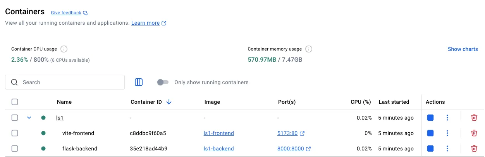

# LS1 Project - Quick Start Guide

## Prerequisites

### Install Docker Desktop

Ensure **Docker Desktop** is installed on your system:
- Download from: [https://www.docker.com/products/docker-desktop](https://www.docker.com/products/docker-desktop)
- Docker Compose is included with Docker Desktop

### Verify Installation

After installation, verify Docker is working properly:

```bash
docker --version
docker compose version
```

You should see output similar to:
```
Docker version 24.0.x, build xxxxx
Docker Compose version v2.x.x
```

**If commands are not recognized:** Ensure Docker Desktop is installed and running, then restart your terminal.

## How to Run the Project

### 1. Start the Application

Navigate to the project root directory and run the following command in the `integration/` folder:

```bash
docker compose up --build -d
```

This command will:
- Build and start both frontend (React + Vite) and backend (Flask) services
- Run containers in the background

Upon successful build, you will see output similar to:

```bash
✔ backend               Built                                                                                                                                      0.0s 
✔ frontend                 Built                                                                                                                                      0.0s 
✔ Container vite-frontend  Started                                                                                                                                    1.2s 
✔ Container flask-backend  Started  
```

You should also see a container named "LS1" in your Docker Desktop.



### 2. Access the Application

Open your browser and navigate to:
- **[http://localhost:5173](http://localhost:5173)**

Alternatively, click the port `5173:80` link in your Docker Desktop interface.

### 3. Explore the Application

**Test Accounts:**
- **Manager:** username: `manager1`, password: `password123`
- **Worker:** username: `worker1`, password: `password123`

### 4. Stop the Application

To stop all services:

```bash
docker compose down
```

## Troubleshooting

### Database Issues

If data is not saving or appears outdated:

1. Stop the application:
   ```bash
   docker compose down
   ```

2. Remove the database file:
   ```bash
   rm backend/app/db/app.db
   ```

3. Restart the application:
   ```bash
   docker compose up --build -d
   ```

---

That's it! You're ready to use the application.